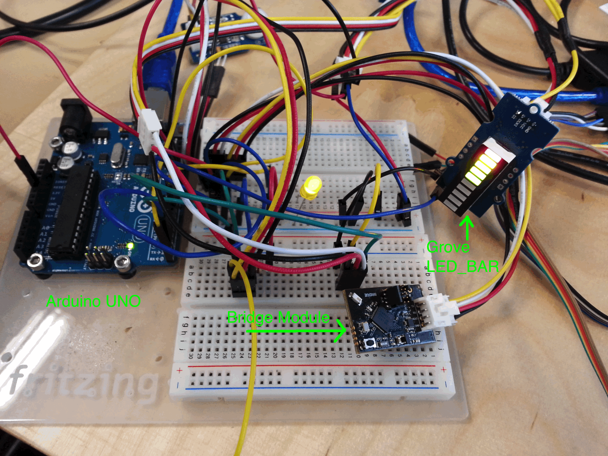

Introduction
------------
Welcome to the **Bridge library for Arduino**.
This repository contains a library and example sketch which allows you to connect the Wunderbar Bridge/Grove module to the Arduino UART and in just 10 minutes have an easy gateway to the **relayr open sensor cloud!**

## Getting Started 
### 1. Import the Library

There are two methods to install the library:

#### Method 1: Import *zip* file
* Download the repository as **.zip** file by clicking in *"Download ZIP"* to the right of the screen.
* In the *Arduino IDE*, navigate to *"Sketch > Import Library"*. At the top of the drop down list, select the option to *"Add Library''*.
* You will be prompted to select the library you would like to add. Navigate to the *.zip* file's location and open it.
* Restart the *Arduino IDE* and go to the *"Sketch > Import Library"* menu. You should now see the library at the bottom of the drop-down menu. It is ready to be used in your sketch. The *Wunderbar Bridge* example should also be available now in the list.

#### Method 2: Using *git clone*
* First quit the *Arduino IDE*. 
* If you have **git** installed just go to the Arduino folder and do a `git clone https://github.com/relayr/Arduino-Bridge-Library.git`. 

    Under *Windows*, it will likely be under *"My Documents\Arduino\"*. For *Mac* users, it will likely be called *"Documents/Arduino/"*. On *Linux*, it will be a folder in your sketchbook. 
* Restart the *Arduino IDE* and go to the *"Sketch > Import Library"* menu. You should now see the library at the bottom of the drop-down menu. It is ready to be used in your sketch. The *Wunderbar Bridge* example should also be available now in the list.

The installed files should look like (in *Mac*):
*Documents/Arduino/libraries/WunderbarBridge/WunderbarBridge.cpp*
*Documents/Arduino/libraries/WunderbarBridge/WunderbarBridge.h*
*Documents/Arduino/examples/GroveBridge example/GroveBridge_example.ino*

### 2. Flash the UART firmware in the Bridge Module
In order to allow the *Bridge Module* to communicate over UART with the *Arduino*, is necessary to flash the Bridge UART Firmware (["sensor\_bridge\_fw\_UART.hex"](https://github.com/relayr/Arduino-Bridge-Library/blob/master/libraries/WunderbarBridge/sensor_bridge_fw_UART.hex)). This binary file is located inside the */libraries* folder.

Please refer to the [relayr documentation] (https://developer.relayr.io/documents/Welcome/Introduction) to learn how to flash a new *firmware* in a *Wunderbar Module*.

### 3. Connect the Bridge Module to the Arduino
#### Necessary connections:
These are the needed connections for the *Arduino UNO*. For different Arduino versions please check the *pin* numbers.

##### a) Connection to the Bridge:
The easiest way of connect it is using a [*"Grove Servo cable"*] (http://www.seeedstudio.com/depot/grove-branch-cable-for-servo5pcs-pack-p-753.html?cPath=178_179) from Seedstudio.

> **Bridge:** --------- **Arduino:**                
Pin # / Name:

> *  **1 - Tx** ----------> **0 - Rx**
* **2 - Rx** ----------> **1 - Tx**
* **3 - Vcc** ---------> **5 Volts**
* **4  - Gnd** ---------> **GND**

##### b) Optional: Debugging connection to the PC serial port:
In order to debug the application, and for instance see what data is coming from the cloud, is very helpful to connect a 2nd. serial port to the *Arduino*. For this, the library uses the *Software Serial Library* (which comes with the *Arduino IDE*, no need to import it). Any USB-to-Serial converter like [this] (http://www.amazon.com/PL2303HX-RS232-Cable-Module-Converter/dp/B008AGDTA4) should work.

> **Arduino:** ------ **PC Serial port:**                
Pin # / Name:

> *  **10 - Rx** --------> **Rx**
* **11 - Tx** --------> **Tx**
* **GNG** -----------> **GND**

**Note:** The example sketch defines *pins* 10 & 11 to connect the *Software Serial* port, but this can be changed to any available digital pin.

The output sent over the UART can be seen with any Serial Monitor Software.

Some serial monitors:

* In *Linux/OSx* the *"screen"* application comes with the OS. It can be used from the terminal with `screen /dev/tty.USBSerialXXX 115200` where XXX is the virtual serial port created when the cable is connected to the PC. 115200 is the *baudrate* used in the example. Other converters can use a different namebase, list the tty devices under */dev* to get the correct one. 
* In *Windows*, a common terminal is ["PUTTY"] (http://www.putty.org/). [Realterm] (http://realterm.sourceforge.net/) also provide useful funcionalities. Please refer to their respect documentation for config options. 

